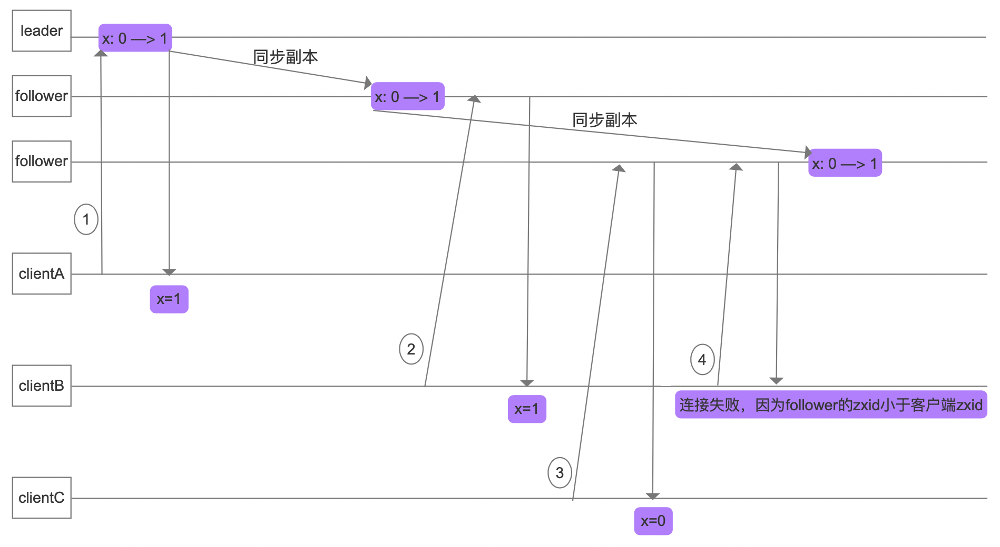
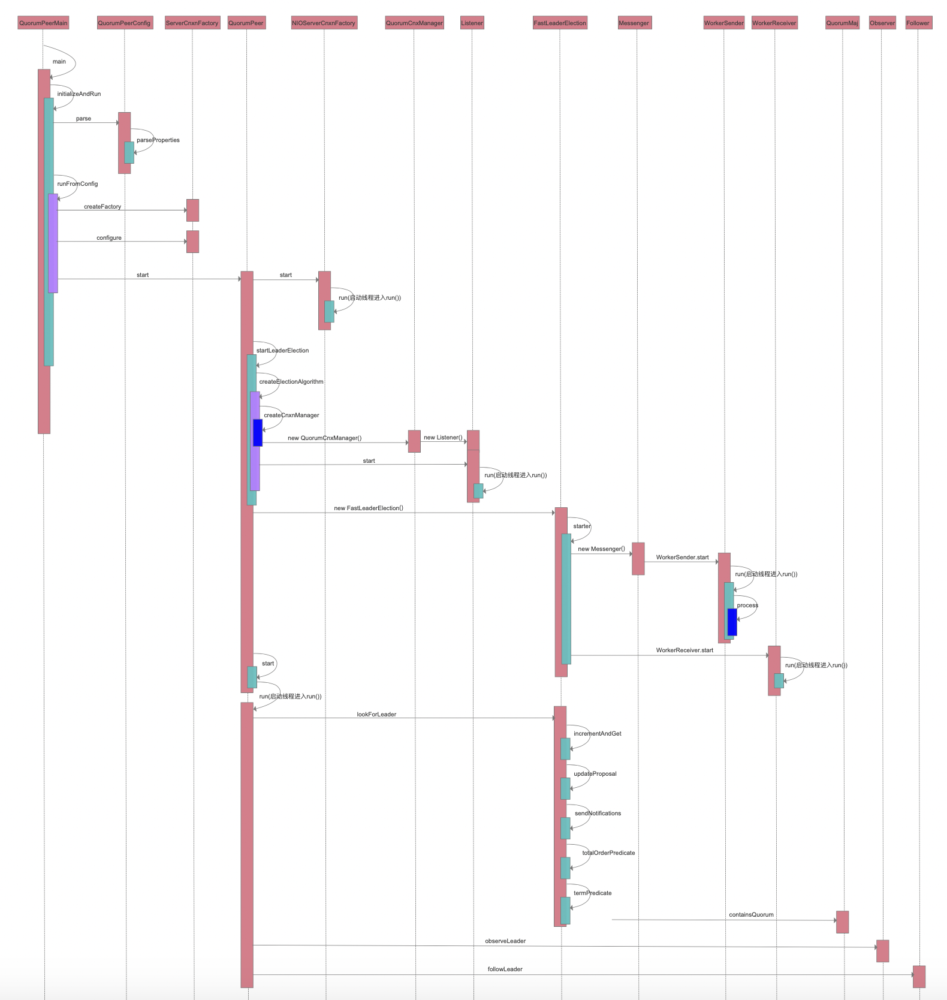

# zookeeper-source-study
zookeeper-source-study

​		ZooKeeper是一个分布式的，开放源码的分布式应用程序协调服务，是Google的Chubby一个开源的实现，是Hadoop和Hbase的重要组件。它是一个为分布式应用提供一致性服务的软件，提供的功能包括：配置维护、域名服务、分布式同步、组服务等。ZooKeeper的目标就是封装好复杂易出错的关键服务，将简单易用的接口和性能高效、功能稳定的系统提供给用户。

# 一、Zookeeper一致性

​		zookeeper集群内部的数据副同步，是基于过半提交的策略，意味着它是最终一致性，并不满足强一致性的要求。

zookeeper是一个顺序一致性模型:

​		当client端首次更新某一个值时，由于leader该值还未及时同步，就会出现数据不一致问题。但是当clientB在2所示位置获取到最新同步值后，位置4又去获取server数据，但是此时连接到另一个未同步数据的follower节点，由于此时clientB的zxid大于follower的zxid，所以连接失败。如下图所示:



# 二、leader选举的源码分析

​		启动Zookeeper时，我们使用脚本启动，因此打开zkServer.sh，找到启动入口类，那么就找到了启动类，进入该类就是源码分析的入口点。入口类是QuorumPeerMain类，找到其main方法即可。

其脚本中有这样一行代码

```shell
# 次处就是启动的入口类QuorumPeerMain
ZOOMAIN="-Dcom.sun.management.jmxremote -Dcom.sun.management.jmxremote.local.only=$JMXLOCALONLY org.apache.zookeeper.server.quorum.QuorumPeerMain"
```

打开QuorumPeerMain类进行源码分析

```java
//进入QuorumPeerMain类public static void main(String[] args)方法，次方法是入口方法QuorumPeerMain#main()
	main.initializeAndRun(args);
	继续调用QuorumPeerMain类方法
  1.protected void initializeAndRun(String[] args) throws ConfigException, IOException方法,QuorumPeerMain#initializeAndRun()
    main.initializeAndRun(args);

//进入QuorumPeerConfig类public void parse(String path) throws ConfigException方法,QuorumPeerConfig#parse()
  config.parse(args[0]); 
	继续调用QuorumPeerConfig类方法
	1.public void parseProperties(Properties zkProp) throws IOException, ConfigException方法，QuorumPeerConfig#parseProperties()
    parseProperties(cfg);

//回到QuorumPeerMain类protected void initializeAndRun(String[] args) throws ConfigException, IOException)方法，次方法是入口方法QuorumPeerMain#initializeAndRun()
	runFromConfig(config);

进入ServerCnxnFactory类static public ServerCnxnFactory createFactory() throws IOException方法，ServerCnxnFactory#createFactory()
  //默认用NIOServerCnxnFactory，此处创建一个NIOServerCnxnFactory类，主要是和通信相关，为后面通信做准备
  ServerCnxnFactory cnxnFactory = ServerCnxnFactory.createFactory();

//回到QuorumPeerMain类public void runFromConfig(QuorumPeerConfig config) throws IOException方法，次方法是入口方法QuorumPeerMain#runFromConfig(),继续调用QuorumPeerMain类方法
	//初始化ZooKeeperThread，并做NIO的初始化工作
	cnxnFactory.configure(config.getClientPortAddress(), config.getMaxClientCnxns());

进入QuorumPeer类public synchronized void start()方法，QuorumPeer#start()
  quorumPeer.start();
	//源码
  @Override
  public synchronized void start() {
    //加载数据()
    loadDataBase(); 
    //跟通信有关系. ->暴露一个2181的端口号,cnxnFactory是在前面ServerCnxnFactory.createFactory()创建的，创建一个NIOServerCnxnFactory实例
    cnxnFactory.start();  
    //开始leader选举-> 启动一个投票的监听、初始化一个选举算法FastLeader.
    startLeaderElection();  
    //当前的QuorumPeer继承Thread，调用Thread.start() ->QuorumPeer.run()
    super.start(); 
  }

进入NIOServerCnxnFactory类public void start()方法，NIOServerCnxnFactory#start()
  cnxnFactory.start();
	//源码
  @Override
  public void start() {
    //此处thread在其构造函数初始化，就是this
    //thread = new ZooKeeperThread(this, "NIOServerCxn.Factory:" + addr);
    // ensure thread is started once and only once
    if (thread.getState() == Thread.State.NEW) {
      //因此此处就会进入NIOServerCnxnFactory类run()方法，NIOServerCnxnFactory#run()
      thread.start();
    }
  }
	继续调用NIOServerCnxnFactory类方法
  1.public void run()方法，NIOServerCnxnFactory#run()
    //当收到客户端的请求时，会需要从这个方法里面来看-> create/delete/setdata
    public void run() {
        while (!ss.socket().isClosed()) {
            try {
                selector.select(1000);
                Set<SelectionKey> selected;
                synchronized (this) {
                    selected = selector.selectedKeys();
                }
                ArrayList<SelectionKey> selectedList = new ArrayList<SelectionKey>(
                        selected);
                Collections.shuffle(selectedList);
                for (SelectionKey k : selectedList) {
                    if ((k.readyOps() & SelectionKey.OP_ACCEPT) != 0) {
                        SocketChannel sc = ((ServerSocketChannel) k
                                .channel()).accept();
                        InetAddress ia = sc.socket().getInetAddress();
                        int cnxncount = getClientCnxnCount(ia);
                        if (maxClientCnxns > 0 && cnxncount >= maxClientCnxns){
                            LOG.warn("Too many connections from " + ia
                                     + " - max is " + maxClientCnxns );
                            sc.close();
                        } else {
                            LOG.info("Accepted socket connection from "
                                     + sc.socket().getRemoteSocketAddress());
                            sc.configureBlocking(false);
                            SelectionKey sk = sc.register(selector,
                                    SelectionKey.OP_READ);
                            NIOServerCnxn cnxn = createConnection(sc, sk);
                            sk.attach(cnxn);
                            addCnxn(cnxn);
                        }
                    } else if ((k.readyOps() & (SelectionKey.OP_READ | SelectionKey.OP_WRITE)) != 0) {
                        NIOServerCnxn c = (NIOServerCnxn) k.attachment();
                        c.doIO(k);
                    } else {
                        if (LOG.isDebugEnabled()) {
                            LOG.debug("Unexpected ops in select "
                                      + k.readyOps());
                        }
                    }
                }
                selected.clear();
            } catch (RuntimeException e) {
                LOG.warn("Ignoring unexpected runtime exception", e);
            } catch (Exception e) {
                LOG.warn("Ignoring exception", e);
            }
        }
        closeAll();
        LOG.info("NIOServerCnxn factory exited run method");
    }

回到QuorumPeer类public synchronized void start()方法，QuorumPeer#start()，继续调用synchronized public void startLeaderElection()方法，QuorumPeer#startLeaderElection()
  //开始leader选举-> 启动一个投票的监听、初始化一个选举算法FastLeader.
  startLeaderElection();  
	//源码
  synchronized public void startLeaderElection() {
    try {
      //构建一个票据,(myid ,zxid ,epoch),用来投票的。
      currentVote = new Vote(myid, getLastLoggedZxid(), getCurrentEpoch());
    } catch(IOException e) {
      RuntimeException re = new RuntimeException(e.getMessage());
      re.setStackTrace(e.getStackTrace());
      throw re;
    }

    for (QuorumServer p : getView().values()) {
      if (p.id == myid) {
        myQuorumAddr = p.addr; //地址： 1 ->myQuorumAddr=127.0.0.1
        break;
      }
    }
    if (myQuorumAddr == null) {
      throw new RuntimeException("My id " + myid + " not in the peer list");
    }
    if (electionType == 0) { //选举的策略
      try {
        udpSocket = new DatagramSocket(myQuorumAddr.getPort());
        responder = new ResponderThread();
        responder.start();
      } catch (SocketException e) {
        throw new RuntimeException(e);
      }
    }
    //
    this.electionAlg = createElectionAlgorithm(electionType);
  }
	继续调用QuorumPeer类方法
  1.protected Election createElectionAlgorithm(int electionAlgorithm)方法，QuorumPeer#createElectionAlgorithm()
    //此处electionType=3，因为在QuorumPeerConfig类中默认值是3，protected int electionAlg = 3;
    this.electionAlg = createElectionAlgorithm(electionType);
		//源码
    protected Election createElectionAlgorithm(int electionAlgorithm){
      Election le=null;

      //TODO: use a factory rather than a switch
      switch (electionAlgorithm) {
        case 0:
          le = new LeaderElection(this);
          break;
        case 1:
          le = new AuthFastLeaderElection(this);
          break;
        case 2:
          le = new AuthFastLeaderElection(this, true);
          break;
        case 3:
          //跟选举有关系，用来接收投票的。
          qcm = createCnxnManager();
          QuorumCnxManager.Listener listener = qcm.listener;
          if(listener != null){
            listener.start();
            //创建一个FastLeaderElection选举算法
            le = new FastLeaderElection(this, qcm);
          } else {
            LOG.error("Null listener when initializing cnx manager");
          }
          break;
        default:
          assert false;
      }
      return le;
    }
	继续调用QuorumPeer类方法
 	1.public QuorumCnxManager createCnxnManager()方法
    //跟选举有关系，用来接收投票的。
    qcm = createCnxnManager();

进入QuorumCnxManager类构造函数
  return new QuorumCnxManager(this.getId(),
                              this.getView(),
                              this.authServer,
                              this.authLearner,
                              this.tickTime * this.syncLimit,
                              this.getQuorumListenOnAllIPs(),
                              this.quorumCnxnThreadsSize,
                              this.isQuorumSaslAuthEnabled());
  //源码
  public QuorumCnxManager(final long mySid,
                          Map<Long,QuorumPeer.QuorumServer> view,
                          QuorumAuthServer authServer,
                          QuorumAuthLearner authLearner,
                          int socketTimeout,
                          boolean listenOnAllIPs,
                          int quorumCnxnThreadsSize,
                          boolean quorumSaslAuthEnabled) {
  	this(mySid, view, authServer, authLearner, socketTimeout, listenOnAllIPs,
       quorumCnxnThreadsSize, quorumSaslAuthEnabled, new ConcurrentHashMap<Long, SendWorker>());
	}
	继续调用QuorumCnxManager类构造函数，再其构造函数创建了一个Listener实例
  // Starts listener thread that waits for connection requests 
  listener = new Listener();

进入FastLeaderElection类，调用其构造函数public FastLeaderElection(QuorumPeer self, QuorumCnxManager manager)
  //创建一个FastLeaderElection选举算法
  le = new FastLeaderElection(this, qcm);
	FastLeaderElection构造函数继续调用FastLeaderElection类private void starter(QuorumPeer self, QuorumCnxManager manager)方法
  //starter方法里面，设置了一些成员属性，并且构建了两个阻塞队列，分别是sendQueue和recvqueue。
  starter(self, manager);
  //源码
	private void starter(QuorumPeer self, QuorumCnxManager manager) {
    this.self = self;
    proposedLeader = -1;
    proposedZxid = -1;

    //sendQueue这个队列的数据，是通过 WorkerSender来进行获取并发送的。而这个WorkerSender线程，在构建 fastLeaderElection 时，会启动
    sendqueue = new LinkedBlockingQueue<ToSend>();
    recvqueue = new LinkedBlockingQueue<Notification>();
    this.messenger = new Messenger(manager);
  }  

进入Messenger类，调用其构造函数Messenger(QuorumCnxManager manager)
  //源码
  Messenger(QuorumCnxManager manager) {
  	//发送票据的线程（用于消费sendQueue）
    this.ws = new WorkerSender(manager); 
    Thread t = new Thread(this.ws, "WorkerSender[myid=" + self.getId() + "]");
  	//守护线程
    t.setDaemon(true); 
    t.start();
  	//接收票据的线程
    this.wr = new WorkerReceiver(manager);
    t = new Thread(this.wr, "WorkerReceiver[myid=" + self.getId() + "]");
  	//守护线程
    t.setDaemon(true);
    t.start();
  }  

回到QuorumPeer类protected Election createElectionAlgorithm(int electionAlgorithm)方法，QuorumPeer#createElectionAlgorithm()，继续调用listener.start();
	//listener是一个Listener线程,调用start进入Listener类的run()方法
	listener.start();

进入Listener类public void run()方法
  listener.start();
	调用start()方法实际是进入run()方法
  //接收投票的处理
  public void run()  

回到QuorumPeer类public synchronized void start()方法，QuorumPeer#start()，继续调用super.start()
  //当前的QuorumPeer继承Thread，调用Thread.start() ->QuorumPeer.run()
  super.start(); 
	调用start()方法实际是进入run()方法

进入FastLeaderElection类public Vote lookForLeader() throws InterruptedException方法，  FastLeaderElection#lookForLeader()  
  //第一次启动的时候，LOOKING,所以会走到以下逻辑
  //setCurrentVote -> 确定了谁是leader了。
  setCurrentVote(makeLEStrategy().lookForLeader());
	继续调用FastLeaderElection类方法
  1.public final long incrementAndGet()方法
    //逻辑时钟->epoch
    logicalclock.incrementAndGet();
	2.synchronized void updateProposal(long leader, long zxid, long epoch)方法
    //proposal
    updateProposal(getInitId(), getInitLastLoggedZxid(), getPeerEpoch());
	3.private void sendNotifications()方法
    //我要广播自己的票据
    sendNotifications();
	4.protected boolean totalOrderPredicate(long newId, long newZxid, long newEpoch, long curId, long curZxid, long curEpoch)方法
    totalOrderPredicate(n.leader, n.zxid, n.peerEpoch,
                                    getInitId(), getInitLastLoggedZxid(), getPeerEpoch())
    //LOOKING部分源码
    // If notification > current, replace and send messages out
    if (n.electionEpoch > logicalclock.get()) { //
      logicalclock.set(n.electionEpoch);
      recvset.clear();//清空
      //收到票据之后，决策最新票据
      //可能是server1的、也可能是server2，也可能是server3
      //zab  leader选举算法
      if(totalOrderPredicate(n.leader, n.zxid, n.peerEpoch,
                             getInitId(), getInitLastLoggedZxid(), getPeerEpoch())) {
        //把自己的票据更新成对方的票据，那么下一次，发送的票据就是新的票据
        updateProposal(n.leader, n.zxid, n.peerEpoch);
      } else {
        //收到的票据小于当前的节点的票据，下一次发送票据，仍然发送自己的
        updateProposal(getInitId(),
                       getInitLastLoggedZxid(),
                       getPeerEpoch());
      }
      //继续发送通知
      sendNotifications();
    }
	5.protected boolean termPredicate(HashMap<Long, Vote> votes, Vote vote)方法
    //决断时刻（当前节点的更新后的vote信息，和recvset集合中的票据进行归纳，）
    termPredicate(recvset, new Vote(proposedLeader, proposedZxid, logicalclock.get(), proposedEpoch))
    
进入QuorumMaj类public boolean containsQuorum(Set<Long> set)方法
  return self.getQuorumVerifier().containsQuorum(set); 

leader选举结束后，需要连接到leader,回到QuorumPeer类public void run()方法
  //OBSERVING, 连接到leader
  进入Observer类void observeLeader() throws InterruptedException方法
  observer.observeLeader();
	//FOLLOWING, 连接到leader
  进入Observer类void followLeader() throws InterruptedException方法
	follower.followLeader(); 
```

leader选举时序图




# 三、watcher源码分析

​		Zookeeper提供了数据的发布/订阅功能，多个订阅者可同时监听某一特定主题对象，当该主题对象的自身状态发生变化时(例如节点内容改变、节点下的子节点列表改变等)，会实时、主动通知所有订阅者。ZooKeeper 的 Watcher 机制，分为三个过程:客户端注册 Watcher、服务器处理 Watcher 和客户端回调 Watcher。客户端注册 watcher三种方式，getData、exists、getChildren。

```java
进入ZooKeeper类构造函数public ZooKeeper(String connectString, int sessionTimeout, Watcher watcher) throws IOException
  //创建ZooKeepe 客户端对象实例时，new Watcher()向构造方法中 传入一个默认的 Watcher, 这个 Watcher 将作为整个 ZooKeeper 会话期间的默认 Watcher，会一直被保存在客户端 ZKWatchManager 的 defaultWatcher 中
  zooKeeper = new ZooKeeper("localhost:2181", 3000, new Watcher() {
    //节点变化回调
    @Override
    public void process(WatchedEvent watchedEvent) {

    }
  });
	继续调用ZooKeeper类构造函数public ZooKeeper(String connectString, int sessionTimeout, Watcher watcher, boolean canBeReadOnly) throws IOException
    public ZooKeeper(String connectString, int sessionTimeout, Watcher watcher, boolean canBeReadOnly) throws IOException {
    	//初始化实例watcher到ZKWatchManager
      this.watchManager = new ZooKeeper.ZKWatchManager();
      LOG.info("Initiating client connection, connectString=" + connectString + " sessionTimeout=" + sessionTimeout + " watcher=" + watcher);
      this.watchManager.defaultWatcher = watcher;
      ConnectStringParser connectStringParser = new ConnectStringParser(connectString);
      HostProvider hostProvider = new StaticHostProvider(connectStringParser.getServerAddresses());
      this.cnxn = new ClientCnxn(connectStringParser.getChrootPath(), hostProvider, sessionTimeout, this, this.watchManager, getClientCnxnSocket(), canBeReadOnly);
      this.cnxn.start();
  	}

进入ClientCnxn类构造函数public ClientCnxn(String chrootPath, HostProvider hostProvider, int sessionTimeout, ZooKeeper zooKeeper, ClientWatchManager watcher, ClientCnxnSocket clientCnxnSocket, boolean canBeReadOnly) throws IOException
  this.cnxn = new ClientCnxn(connectStringParser.getChrootPath(), hostProvider, sessionTimeout, this, this.watchManager, getClientCnxnSocket(), canBeReadOnly);
	继续调用ClientCnxn类构造函数public ClientCnxn(String chrootPath, HostProvider hostProvider, int sessionTimeout, ZooKeeper zooKeeper, ClientWatchManager watcher, ClientCnxnSocket clientCnxnSocket, long sessionId, byte[] sessionPasswd, boolean canBeReadOnly)
  this(chrootPath, hostProvider, sessionTimeout, zooKeeper, watcher, clientCnxnSocket, 0L, new byte[16], canBeReadOnly);
	//源码
  public ClientCnxn(String chrootPath, HostProvider hostProvider, int sessionTimeout, ZooKeeper zooKeeper, ClientWatchManager watcher, ClientCnxnSocket clientCnxnSocket, long sessionId, byte[] sessionPasswd, boolean canBeReadOnly) {
    this.authInfo = new CopyOnWriteArraySet();
    this.pendingQueue = new LinkedList();
    this.outgoingQueue = new LinkedList();
    this.sessionPasswd = new byte[16];
    this.closing = false;
    this.seenRwServerBefore = false;
    this.eventOfDeath = new Object();
    this.xid = 1;
    this.state = States.NOT_CONNECTED;
    this.zooKeeper = zooKeeper;
    this.watcher = watcher;
    this.sessionId = sessionId;
    this.sessionPasswd = sessionPasswd;
    this.sessionTimeout = sessionTimeout;
    this.hostProvider = hostProvider;
    this.chrootPath = chrootPath;
    this.connectTimeout = sessionTimeout / hostProvider.size();
    this.readTimeout = sessionTimeout * 2 / 3;
    this.readOnly = canBeReadOnly;
    //负责客户端和服务器端的数据通信, 也包括事件信息的传输
    this.sendThread = new ClientCnxn.SendThread(clientCnxnSocket);
    //主要在客户端回调注册的 Watchers 进行通知处理
    this.eventThread = new ClientCnxn.EventThread();
  }

回来ZooKeeper类，继续调用ZooKeeper类方法
  1.public Stat exists(String path, boolean watch) throws KeeperException, InterruptedException方法
    zooKeeper.exists(path,true)
  2.public Stat exists(String path, Watcher watcher) throws KeeperException, InterruptedException方法
    return this.exists(path, watch ? this.watchManager.defaultWatcher : null);

进入ZooKeeper类内部类ExistsWatchRegistration类的构造函数public ExistsWatchRegistration(Watcher watcher, String clientPath)
  wcb = new ZooKeeper.ExistsWatchRegistration(watcher, path);

回到ZooKeeper类内部类public Stat exists(String path, Watcher watcher) throws KeeperException, InterruptedException 方法
  //源码
  public Stat exists(String path, Watcher watcher) throws KeeperException, InterruptedException {
    PathUtils.validatePath(path);
    ZooKeeper.WatchRegistration wcb = null;
    if (watcher != null) {
      wcb = new ZooKeeper.ExistsWatchRegistration(watcher, path);
    }

    String serverPath = this.prependChroot(path);
    RequestHeader h = new RequestHeader();
    h.setType(3);
    //构建request
    ExistsRequest request = new ExistsRequest();
    request.setPath(serverPath);
    request.setWatch(watcher != null);
  	//构建response
    SetDataResponse response = new SetDataResponse();
  	//提交request
  	//此处cnxn是在ZooKeeper类构造函数实例化的，cnxn是一个ClientCnxn实例
    ReplyHeader r = this.cnxn.submitRequest(h, request, response, wcb);
    if (r.getErr() != 0) {
      if (r.getErr() == Code.NONODE.intValue()) {
        return null;
      } else {
        throw KeeperException.create(Code.get(r.getErr()), path);
      }
    } else {
      return response.getStat().getCzxid() == -1L ? null : response.getStat();
    }
  }

进入ClientCnxn类public ReplyHeader submitRequest(RequestHeader h, Record request, Record response, WatchRegistration watchRegistration) throws InterruptedException方法
  ReplyHeader r = this.cnxn.submitRequest(h, request, response, wcb);
	继续调用类方法
  1.ClientCnxn.Packet queuePacket(RequestHeader h, ReplyHeader r, Record request, Record response, AsyncCallback cb, String clientPath, String serverPath, Object ctx, WatchRegistration watchRegistration)方法
    ClientCnxn.Packet packet = this.queuePacket(h, r, request, response, (AsyncCallback)null, (String)null, (String)null, (Object)null, watchRegistration);

进入ClientCnxn类内部类SendThread的public void run()方法，该方法负责客户端和服务器端的数据通信, 也包括事件信息的传输
  //核心代码
  clientCnxnSocket.doTransport(to, ClientCnxn.this.pendingQueue, ClientCnxn.this.outgoingQueue, ClientCnxn.this);

进入ClientCnxnSocketNIO类void doTransport(int waitTimeOut, List<Packet> pendingQueue, LinkedList<Packet> outgoingQueue, ClientCnxn cnxn) throws IOException, InterruptedException方法
  clientCnxnSocket.doTransport(to, ClientCnxn.this.pendingQueue, ClientCnxn.this.outgoingQueue, ClientCnxn.this);
 继续调用ClientCnxnSocketNIO类void doIO(List<Packet> pendingQueue, LinkedList<Packet> outgoingQueue, ClientCnxn cnxn) throws InterruptedException, IOException方法
 1.void doIO(List<Packet> pendingQueue, LinkedList<Packet> outgoingQueue, ClientCnxn cnxn) throws InterruptedException, IOException方法
   doIO(pendingQueue, outgoingQueue, cnxn);

进入ClientCnxn内部类Packet类public void createBB()方法
  p.createBB();
	
服务端
数据发送后在服务端接收，在服务端NIOServerCnxnFactory类public void run()方法
  //源码
  //当收到客户端的请求时，会需要从这个方法里面来看-> create/delete/setdata，包括exist/ping/connect等请求都会进入
  public void run() {
    while (!ss.socket().isClosed()) {
      try {
        selector.select(1000);
        Set<SelectionKey> selected;
        synchronized (this) {
          selected = selector.selectedKeys();
        }
        ArrayList<SelectionKey> selectedList = new ArrayList<SelectionKey>(
          selected);
        Collections.shuffle(selectedList);
        for (SelectionKey k : selectedList) {
          if ((k.readyOps() & SelectionKey.OP_ACCEPT) != 0) {
            SocketChannel sc = ((ServerSocketChannel) k
                                .channel()).accept();
            InetAddress ia = sc.socket().getInetAddress();
            int cnxncount = getClientCnxnCount(ia);
            if (maxClientCnxns > 0 && cnxncount >= maxClientCnxns){
              LOG.warn("Too many connections from " + ia
                       + " - max is " + maxClientCnxns );
              sc.close();
            } else {
              LOG.info("Accepted socket connection from "
                       + sc.socket().getRemoteSocketAddress());
              sc.configureBlocking(false);
              SelectionKey sk = sc.register(selector,
                                            SelectionKey.OP_READ);
              NIOServerCnxn cnxn = createConnection(sc, sk);
              sk.attach(cnxn);
              addCnxn(cnxn);
            }
          } else if ((k.readyOps() & (SelectionKey.OP_READ | SelectionKey.OP_WRITE)) != 0) {
            NIOServerCnxn c = (NIOServerCnxn) k.attachment();
            c.doIO(k);
          } else {
            if (LOG.isDebugEnabled()) {
              LOG.debug("Unexpected ops in select "
                        + k.readyOps());
            }
          }
        }
        selected.clear();
      } catch (RuntimeException e) {
        LOG.warn("Ignoring unexpected runtime exception", e);
      } catch (Exception e) {
        LOG.warn("Ignoring exception", e);
      }
    }
    closeAll();
    LOG.info("NIOServerCnxn factory exited run method");
  }
  
进入NIOServerCnxn类void doIO(SelectionKey k) throws InterruptedException方法
  c.doIO(k);
	继续调用NIOServerCnxn类方法
  1.private void readPayload() throws IOException, InterruptedException方法
    readPayload();
	2.private void readRequest() throws IOException方法
    //读取客服端请求数据
    readRequest();

进入ZooKeeperServer类public void processPacket(ServerCnxn cnxn, ByteBuffer incomingBuffer) throws IOException方法
  zkServer.processPacket(this, incomingBuffer);
	继续调用ZooKeeperServer类方法
  1.public void submitRequest(Request si)方法
    submitRequest(si);    
		//源码
		public void submitRequest(Request si) {
        if (firstProcessor == null) {
            synchronized (this) {
                try {
                    // Since all requests are passed to the request
                    // processor it should wait for setting up the request
                    // processor chain. The state will be updated to RUNNING
                    // after the setup.
                    while (state == State.INITIAL) {
                        wait(1000);
                    }
                } catch (InterruptedException e) {
                    LOG.warn("Unexpected interruption", e);
                }
                if (firstProcessor == null || state != State.RUNNING) {
                    throw new RuntimeException("Not started");
                }
            }
        }
        try {
            touch(si.cnxn);
            boolean validpacket = Request.isValid(si.type);
            if (validpacket) {
                firstProcessor.processRequest(si);
                if (si.cnxn != null) {
                    incInProcess();
                }
            } else {
                LOG.warn("Received packet at server of unknown type " + si.type);
                new UnimplementedRequestProcessor().processRequest(si);
            }
        } catch (MissingSessionException e) {
            if (LOG.isDebugEnabled()) {
                LOG.debug("Dropping request: " + e.getMessage());
            }
        } catch (RequestProcessorException e) {
            LOG.error("Unable to process request:" + e.getMessage(), e);
        }
    }
		此处firstProcessor是一个责任链模式，在protected void setupRequestProcessors()方法中初始化,但firstProcessor又分为单机和集群模式
    单机模式:PrepRequestProcessor -> SyncRequestProcessor -> FinalRequestProcessor
    protected void setupRequestProcessors() {
      RequestProcessor finalProcessor = new FinalRequestProcessor(this);
      RequestProcessor syncProcessor = new SyncRequestProcessor(this,
                                                                finalProcessor);
      ((SyncRequestProcessor)syncProcessor).start();
      firstProcessor = new PrepRequestProcessor(this, syncProcessor);
      ((PrepRequestProcessor)firstProcessor).start();
    }
		集群模式下，leader和follower有区别
    leader(LeaderZooKeeperServer):
		PrepRequestProcessor -> ProposalRequestProcessor -> CommitProcessor -> ToBeAppliedRequestProcessor -> FinalRequestProcessors
    follower(FollowerZooKeeperServer):
		1.FollowerRequestProcessor -> CommitProcessor -> FinalRequestProcessor
    2.SyncRequestProcessor -> SendAckRequestProcessor
    
单机模式下源码分析，回到ZooKeeperServer类public void submitRequest(Request si)方法，继续往下执行
	firstProcessor.processRequest(si);
进入PrepRequestProcessor类public void processRequest(Request request)方法
  //请求加入阻塞队列，哪必然有消费者进行消费(生产者消费者模式)，PrepRequestProcessor是一个继承线程类，因此在public void run()消费
  submittedRequests.add(request);
	因此进入PrepRequestProcessor类public void run()方法
  继续调用PrepRequestProcessor类方法
  1.protected void pRequest(Request request) throws RequestProcessorException方法
    pRequest(request);

进入SyncRequestProcessor类public void processRequest(Request request)方法
  //此处也是加入阻塞队列，消费者进行消费(生产者消费者模式)，SyncRequestProcessor是一个继承线程类，因此在public void run()消费
  nextProcessor.processRequest(request);
	因此进入SyncRequestProcessor类public void run()方法
  //源码
  public void run() {
    try {
      int logCount = 0;

      // we do this in an attempt to ensure that not all of the servers
      // in the ensemble take a snapshot at the same time
      setRandRoll(r.nextInt(snapCount/2));
      while (true) {
        Request si = null;
        if (toFlush.isEmpty()) {
          si = queuedRequests.take();
        } else {
          si = queuedRequests.poll();
          if (si == null) {
            flush(toFlush);
            continue;
          }
        }
        if (si == requestOfDeath) {
          break;
        }
        if (si != null) {
          //把请求持久化到本地磁盘
          // track the number of records written to the log
          if (zks.getZKDatabase().append(si)) {
            logCount++;
            if (logCount > (snapCount / 2 + randRoll)) {
              setRandRoll(r.nextInt(snapCount/2));
              // roll the log
              zks.getZKDatabase().rollLog();
              // take a snapshot
              if (snapInProcess != null && snapInProcess.isAlive()) {
                LOG.warn("Too busy to snap, skipping");
              } else {
                snapInProcess = new ZooKeeperThread("Snapshot Thread") {
                  public void run() {
                    try {
                      zks.takeSnapshot();
                    } catch(Exception e) {
                      LOG.warn("Unexpected exception", e);
                    }
                  }
                };
                snapInProcess.start();
              }
              logCount = 0;
            }
          } else if (toFlush.isEmpty()) {
            // optimization for read heavy workloads
            // iff this is a read, and there are no pending
            // flushes (writes), then just pass this to the next
            // processor
            if (nextProcessor != null) {
              nextProcessor.processRequest(si);
              if (nextProcessor instanceof Flushable) {
                ((Flushable)nextProcessor).flush();
              }
            }
            continue;
          }
          toFlush.add(si);
          if (toFlush.size() > 1000) {
            flush(toFlush);
          }
        }
      }
    } catch (Throwable t) {
      handleException(this.getName(), t);
      running = false;
    }
    LOG.info("SyncRequestProcessor exited!");
  }

进入FinalRequestProcessor类public void processRequest(Request request)方法
  nextProcessor.processRequest(si);

进入ZooKeeperServer类public ProcessTxnResult processTxn(TxnHeader hdr, Record txn)方法
  //如果setData、delete操作会调用该方法
  rc = zks.processTxn(hdr, txn);

回到FinalRequestProcessor类public void processRequest(Request request)方法，继续执行
  //部分源码
  case OpCode.exists: {
    lastOp = "EXIS";
    // TODO we need to figure out the security requirement for this!
    ExistsRequest existsRequest = new ExistsRequest();
    //反序列化(将ByteBuffer反序列化成为ExitsRequest，这个就是在客户端发起请求的时候传递过来的Request对象)
    ByteBufferInputStream.byteBuffer2Record(request.request,
                                            existsRequest);
    //获取请求的路径
    String path = existsRequest.getPath();
    if (path.indexOf('\0') != -1) {
      throw new KeeperException.BadArgumentsException();
    }
    //判断请求的getWatch是否存在，如果存在，则传递cnxn(servercnxn网络处理类)
		//对于exists请求，需要监听data变化事件，添加 watcher
    Stat stat = zks.getZKDatabase().statNode(path, existsRequest
                                             .getWatch() ? cnxn : null);
    //在服务端内存数据库中根据路径得到结果进行组装，封装为ExistsResponse
    rsp = new ExistsResponse(stat);
    break;
  }

进入ZKDatabase类public Stat statNode(String path, ServerCnxn serverCnxn) throws KeeperException.NoNodeException方法
  Stat stat = zks.getZKDatabase().statNode(path, existsRequest
                        .getWatch() ? cnxn : null);

进入DataTree类public Stat statNode(String path, Watcher watcher) throws KeeperException.NoNodeException方法  
	return dataTree.statNode(path, serverCnxn);

进入WatchManager类public synchronized void addWatch(String path, Watcher watcher)方法
  dataWatches.addWatch(path, watcher);
	//源码
	public synchronized void addWatch(String path, Watcher watcher) {
    //list -> HashSet(ServerCnxn)， Stat stat = zks.getZKDatabase().statNode(path, existsRequest.getWatch() ? cnxn : null);
    HashSet<Watcher> list = watchTable.get(path);
    if (list == null) {
      // don't waste memory if there are few watches on a node
      // rehash when the 4th entry is added, doubling size thereafter
      // seems like a good compromise
      list = new HashSet<Watcher>(4);
      watchTable.put(path, list);
    }
    list.add(watcher);

    //反转watchTable
    HashSet<String> paths = watch2Paths.get(watcher);
    if (paths == null) {
      // cnxns typically have many watches, so use default cap here
      paths = new HashSet<String>();
      watch2Paths.put(watcher, paths);
    }
    paths.add(path);
  }

回到FinalRequestProcessor类public void processRequest(Request request)方法，继续执行
	cnxn.sendResponse(hdr, rsp, "response");

回到客户端
回到客户端读取服务端数据处，在ClientCnxnSocketNIO类void doIO(List<Packet> pendingQueue, LinkedList<Packet> outgoingQueue, ClientCnxn cnxn) throws InterruptedException, IOException方法
  //读取服务端相应数据
  sendThread.readResponse(incomingBuffer);

进入SendThread类void readResponse(ByteBuffer incomingBuffer) throws IOException方法
  sendThread.readResponse(incomingBuffer);

进入ClientCnxn类private void finishPacket(Packet p)方法
  finishPacket(packet);

进入WatchRegistration类public void register(int rc)方法
  //注册到本地
  p.watchRegistration.register(p.replyHeader.getErr());

进入ExistsWatchRegistration类protected Map<String, Set<Watcher>> getWatches(int rc)方法
  protected Map<String, Set<Watcher>> getWatches(int rc)

进入ZKWatchManager类
	//部分源码
  //客户端存储watcher的几个map集合，分别对应三种注册监听事件
  //使用ZooKeeper构造方法或者使用getData、exists和getChildren三个接口来向ZooKeeper服务器注册Watcher的时候，首先将此消息传递给服务端，传递成功后，服务端会通知客户端，然后客户端将该路径和Watcher对应关系存储起来备用。
  //dataWatches存储是path对应的Watcher实现
  private final Map<String, Set<Watcher>> dataWatches = new HashMap<String, Set<Watcher>>();
  private final Map<String, Set<Watcher>> existWatches = new HashMap<String, Set<Watcher>>();
  private final Map<String, Set<Watcher>> childWatches = new HashMap<String, Set<Watcher>>();

回到WatchRegistration类public void register(int rc)方法，继续执行
  //把Packet加入waitingEvents一个阻塞队列
  //eventThread是一个EventThread实例，该实例是一个继承线程类，因此会进入EventThread类public void run()方法
  eventThread.queuePacket(p);

进入EventThread类public void run()方法

事件触发
//修改节点的值触发监听
zookeeper.setData(“/watch”, “123”.getByte(), -1) ; 

服务端的事件响应 
DataTree.setData()
进入FinalRequestProcessor类public void processRequest(Request request)方法，诺是事务请求，会执行
  rc = zks.processTxn(hdr, txn);

进入ZooKeeperServer类public ProcessTxnResult processTxn(TxnHeader hdr, Record txn)方法
  rc = zks.processTxn(hdr, txn);

进入ZKDatabase类public ProcessTxnResult processTxn(TxnHeader hdr, Record txn)方法
  rc = getZKDatabase().processTxn(hdr, txn);

进入DataTree类public ProcessTxnResult processTxn(TxnHeader header, Record txn)方法
  return dataTree.processTxn(hdr, txn);
	继续调用DataTree类方法
  1.public String createNode(String path, byte data[], List<ACL> acl,
            long ephemeralOwner, int parentCVersion, long zxid, long time)
            throws KeeperException.NoNodeException,
            KeeperException.NodeExistsException
    createNode(
              createTxn.getPath(),
              createTxn.getData(),
              createTxn.getAcl(),
              createTxn.getEphemeral() ? header.getClientId() : 0,
              createTxn.getParentCVersion(),
              header.getZxid(), header.getTime());     

进入WatchManager类public Set<Watcher> triggerWatch(String path, EventType type)方法
  dataWatches.triggerWatch(path, Event.EventType.NodeCreated);
	继续调用WatchManager类方法
  1.public Set<Watcher> triggerWatch(String path, EventType type, Set<Watcher> supress)方法
    return triggerWatch(path, type, null);
		//源码
    public Set<Watcher> triggerWatch(String path, EventType type, Set<Watcher> supress) {
      WatchedEvent e = new WatchedEvent(type,
                                        KeeperState.SyncConnected, path);
      HashSet<Watcher> watchers;
      synchronized (this) {
        //每次监听结束会移除监听路径，这就是为什么只能监听一次，因为资源有限，监听太多会占用太多内存资源
        watchers = watchTable.remove(path);
        if (watchers == null || watchers.isEmpty()) {
          if (LOG.isTraceEnabled()) {
            ZooTrace.logTraceMessage(LOG,
                                     ZooTrace.EVENT_DELIVERY_TRACE_MASK,
                                     "No watchers for " + path);
          }
          return null;
        }
        for (Watcher w : watchers) {
          //ServerCnxn -> paths(多个路径)
          HashSet<String> paths = watch2Paths.get(w);
          if (paths != null) {
            paths.remove(path);
          }
        }
      }
      for (Watcher w : watchers) {
        if (supress != null && supress.contains(w)) {
          continue;
        }
        w.process(e);
      }
      return watchers;
    }

进入NIOServerCnxn类synchronized public void process(WatchedEvent event)方法
  w.process(e);
	继续调用NIOServerCnxn类方法
  1.synchronized public void sendResponse(ReplyHeader h, Record r, String tag)方法
    //数据写到客户端
  	sendResponse(h, e, "notification");
		//源码
    @Override
    synchronized public void process(WatchedEvent event) {
        ReplyHeader h = new ReplyHeader(-1, -1L, 0);
        if (LOG.isTraceEnabled()) {
            ZooTrace.logTraceMessage(LOG, ZooTrace.EVENT_DELIVERY_TRACE_MASK,
                                     "Deliver event " + event + " to 0x"
                                     + Long.toHexString(this.sessionId)
                                     + " through " + this);
        }

        // Convert WatchedEvent to a type that can be sent over the wire
        WatcherEvent e = event.getWrapper();

        sendResponse(h, e, "notification");
    }

回到客户端
回到客户端读取服务端数据处，在ClientCnxnSocketNIO类void doIO(List<Packet> pendingQueue, LinkedList<Packet> outgoingQueue, ClientCnxn cnxn) throws InterruptedException, IOException方法
  //读取服务端相应数据
  sendThread.readResponse(incomingBuffer);
	
进入SendThread类void readResponse(ByteBuffer incomingBuffer) throws IOException方法
  sendThread.readResponse(incomingBuffer);
	//因为服务端返回xid = -1
	if (replyHdr.getXid() == -1) {
    // -1 means notification
    if (LOG.isDebugEnabled()) {
      LOG.debug("Got notification sessionid:0x"
                + Long.toHexString(sessionId));
    }
    WatcherEvent event = new WatcherEvent();
    event.deserialize(bbia, "response");

    // convert from a server path to a client path
    if (chrootPath != null) {
      String serverPath = event.getPath();
      if(serverPath.compareTo(chrootPath)==0)
        event.setPath("/");
      else if (serverPath.length() > chrootPath.length())
        event.setPath(serverPath.substring(chrootPath.length()));
      else {
        LOG.warn("Got server path " + event.getPath()
                 + " which is too short for chroot path "
                 + chrootPath);
      }
    }

    WatchedEvent we = new WatchedEvent(event);
    if (LOG.isDebugEnabled()) {
      LOG.debug("Got " + we + " for sessionid 0x"
                + Long.toHexString(sessionId));
    }

    eventThread.queueEvent( we );
    return;
  }
	加入waitingEvents阻塞队列，在SendThread类public void run()方法中消费
  
进入ClientCnxn类private void processEvent(Object event)方法
  processEvent(event);
	//部分源码
  if (event instanceof WatcherSetEventPair) {
    // each watcher will process the event
    WatcherSetEventPair pair = (WatcherSetEventPair) event;
    for (Watcher watcher : pair.watchers) {
      try {
        //此处会进入初始化时实现的Watcher实例public void process(WatchedEvent watchedEvent)方法
        watcher.process(pair.event);
      } catch (Throwable t) {
        LOG.error("Error while calling watcher ", t);
      }
    }
  }
	//初始化实现的Watcher实例，及会进入process方法
	zooKeeper = new ZooKeeper("localhost:2181", 4000, new Watcher() {
    @Override
    public void process(WatchedEvent watchedEvent) {

    }
  });
```

Watcher时序图


